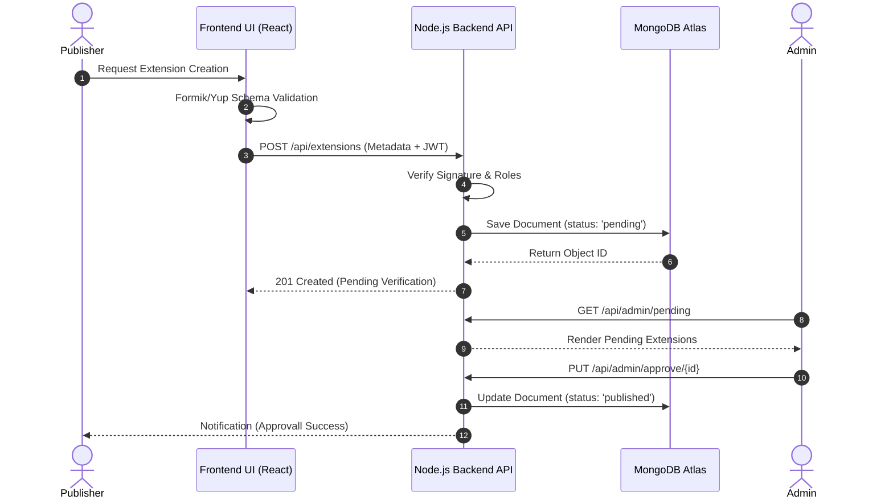
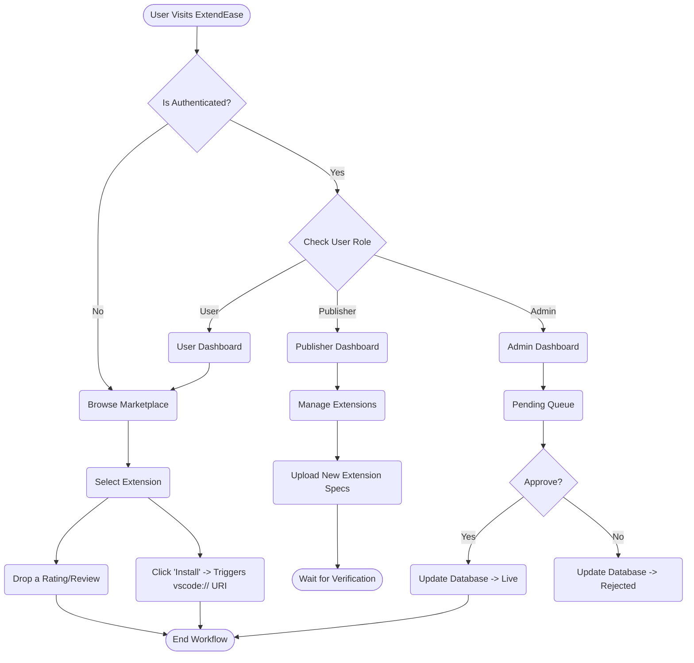
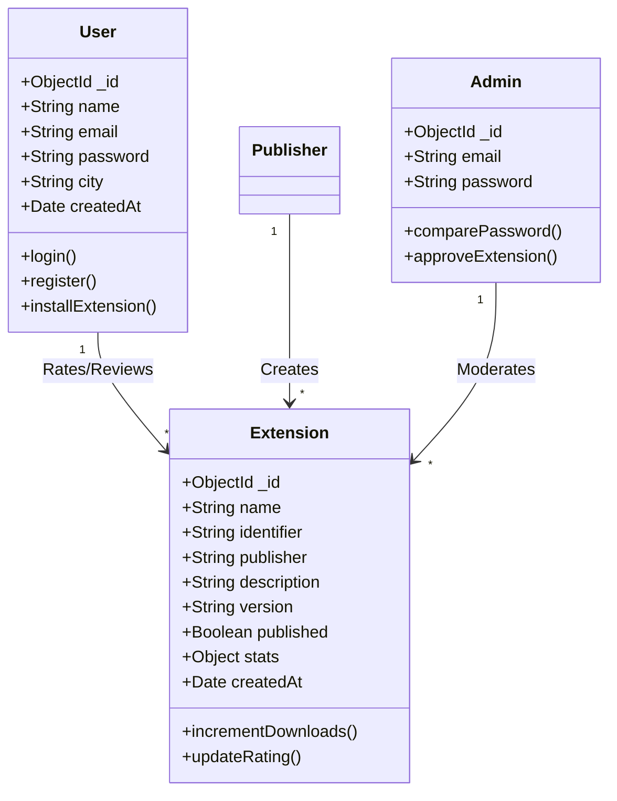
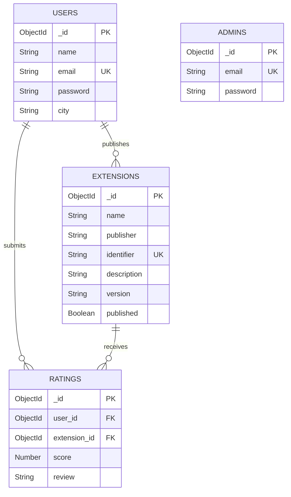

# CHAPTER 4: SYSTEM DESIGN

System Design represented the transformative phase where the abstract analytical requirements detailed in previous chapters were translated into systematic architectures, logical structures, and standardized digital blueprints. This chapter dictates exactly how data flows and logic boundaries were established within the ExtendEase ecosystem.

## 4.1 System Architecture
ExtendEase predominantly utilized a localized iteration of the ubiquitous Client-Server Architecture, specifically modeled using the MERN stack paradigm.

The system was constituted of three conceptual tiers:
1. **The Presentation Tier (React Client):** This tier handled all synchronous UI updates, form renderings, and URI triggers targeting the user's localized Visual Studio Code environment.
2. **The Application Logic Tier (Express/Node Server):** Functioning as the central nervous system regulating all asynchronous behaviors. It governed JWT authentication verification, administration request algorithms, rate limiting, and HTTP routing protocols.
3. **The Data Tier (MongoDB):** The final persistent layer that orchestrated data integrity. By utilizing document-based collections (`Extensions`, `Users`, `Admins`), this tier efficiently scaled complex relational abstractions dynamically.

## 4.2 Unified Modeling Language (UML) Diagrams
UML functioned as a standardized modeling language that provided a visual representation used to analyze, design, and implement the software system architecturally.

### 4.2.1 Use Case Diagram
The Use Case diagram was drawn to encapsulate the distinct behavioral interactions between the system's human actors (Admin, User, Publisher) and the core platform features.

```mermaid
usecaseDiagram
    actor Admin
    actor User
    actor Publisher

    rectangle "ExtendEase System Architecture" {
        usecase "Browse & Search Logic" as UC1
        usecase "Trigger URI Install" as UC2
        usecase "Rate & Review" as UC3
        usecase "Upload VSIX Metadata" as UC4
        usecase "Track Analytics" as UC5
        usecase "Approve/Reject Tool" as UC6
        usecase "Ban Publisher" as UC7
        usecase "User Authentication" as UC8
        
        User --> UC1
        User --> UC2
        User --> UC3
        User --> UC8
        
        Publisher --> UC8
        Publisher --> UC1
        Publisher --> UC4
        Publisher --> UC5
        
        Admin --> UC8
        Admin --> UC6
        Admin --> UC7
    }
```

### 4.2.2 Sequence Diagram (Publishing Flow)
A sequence diagram was developed to explicitly highlight the chronological messaging that dictated execution across object lifelines. Importantly, it depicted the strict moderation pipeline a publisher went through.



### 4.2.3 Activity Diagram
Activity diagrams visually dictated the generalized graphical flow of control from one operational activity to another within the secure bounds of the application.



### 4.2.4 Class Diagram
The Class diagram was created to map out the rigid, static structure of the ExtendEase system, natively mirroring the Object-Oriented layouts deployed within the Mongoose schemas.



## 4.3 Entity Relationship Diagram (ERD)
The ERD denoted the logical architecture mapping the constraints of the data models deployed across the NoSQL MongoDB deployment.



## 4.4 Database Design / Schema
Data modeling via Mongoose transformed the schema-less nature of traditional MongoDB into a heavily structured object layout, thereby significantly reducing data anomalies. 

**Table 4.1: User Collection Schema (`users`)**
| Field Name | Data Type | Constraint | Description |
| :--- | :--- | :--- | :--- |
| `_id` | ObjectId | Primary Key | Auto-generated standard 12-byte identifier |
| `name` | String | Required | Represented Developer's Full Name |
| `email` | String | Required, Unique | Developer email credentials |
| `password` | String | Required | Encrypted Bcrypt Hash |
| `city` | String | Optional | Localized developer region |

**Table 4.2: Extension Collection Schema (`extensions`)**
| Field Name | Data Type | Constraint | Description |
| :--- | :--- | :--- | :--- |
| `identifier` | String | Required, Unique | Built for Target IDE URI Scheme (`publisher.name`) |
| `name` | String | Required | The visual nomenclature of the package |
| `publisher` | String | Required | Derived ID extracted from the Publisher's Token |
| `published` | Boolean | Default: false | Admin verification toggle lock |
| `version` | String | Required | SemVer string layout (`1.0.0`) |
| `stats` | Object | Complex | Stored dynamic `downloads` and `rating` aggregates |
