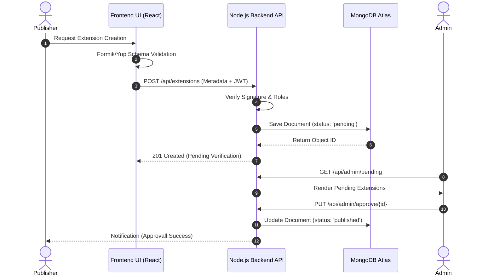
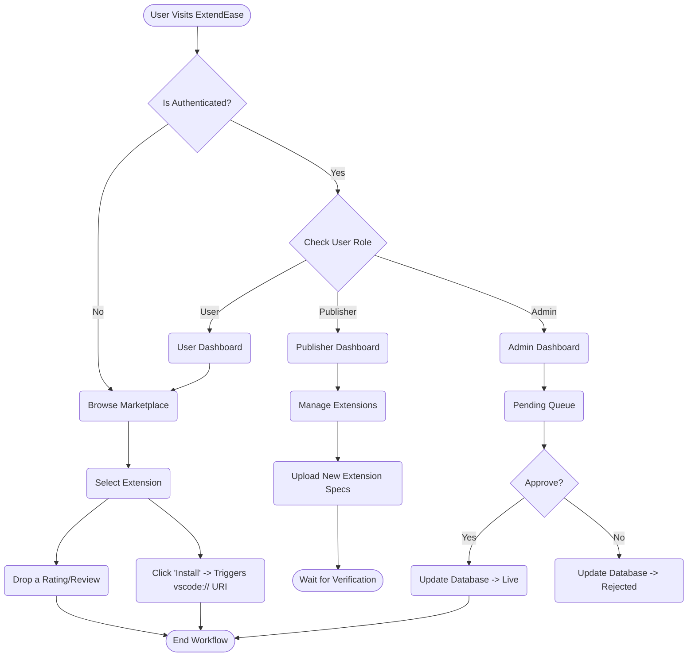
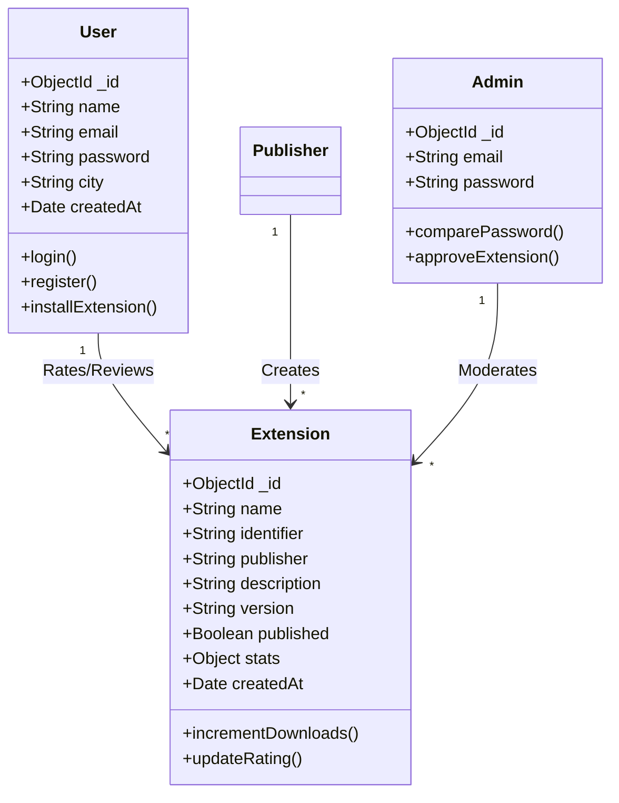
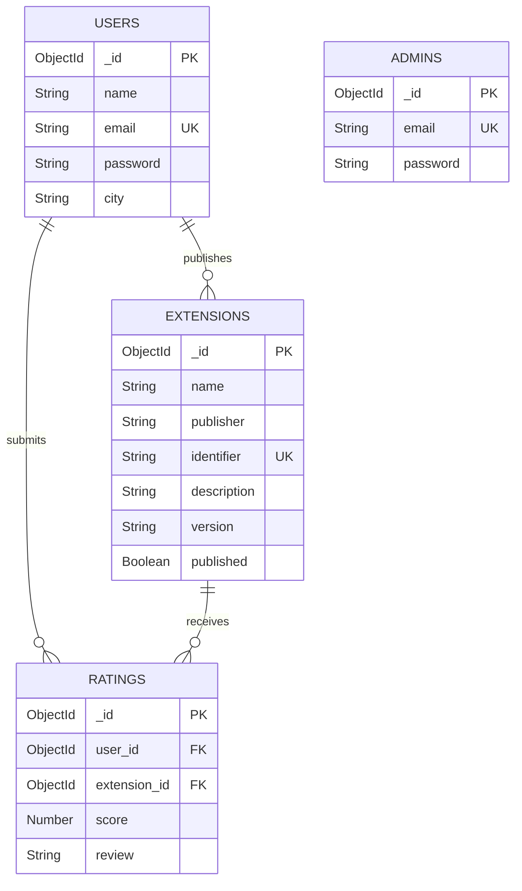

<div align="center">

# A MAJOR PROJECT REPORT ON

## “ExtendEase – VS Code Extensions Marketplace Website”

### Submitted in partial fulfillment of the requirements for the award of the degree of

**BACHELOR OF TECHNOLOGY (B.Tech)**  
**IN**  
**COMPUTER SCIENCE AND ENGINEERING**

**Submitted By:**  
**[Your Name / Team Names]**  
**[Roll Numbers]**

**Under the esteemed guidance of:**  
**[Guide Name, E.g., Dr. John Doe]**  
**[Guide Designation]**

**[Department Name]**  
**[College/University Name]**  
**[City, Pincode]**  
**[Year, E.g., 2026]**

</div>

<div style="page-break-after: always"></div>

## CERTIFICATE

This is to certify that the project report entitled **“ExtendEase – VS Code Extensions Marketplace Website”**, submitted by **[Your Name] ([Roll Number])** in partial fulfillment of the requirements for the award of the Degree of Bachelor of Technology in Computer Science and Engineering from **[University Name]**, is an authentic record of the major project work carried out under my supervision and guidance. 

The matter embodied in this project report has not been submitted by them earlier for the award of any degree or diploma to the best of my knowledge and belief.

<br><br><br>

--------------------------------------- &nbsp;&nbsp;&nbsp;&nbsp;&nbsp;&nbsp;&nbsp;&nbsp;&nbsp;&nbsp;&nbsp;&nbsp;&nbsp;&nbsp;&nbsp;&nbsp;&nbsp;&nbsp;&nbsp;&nbsp;&nbsp;&nbsp;&nbsp;&nbsp;&nbsp;&nbsp;&nbsp;&nbsp;&nbsp;&nbsp;&nbsp;&nbsp;&nbsp;&nbsp;&nbsp;&nbsp;&nbsp;&nbsp;&nbsp;&nbsp;&nbsp;&nbsp;&nbsp;&nbsp;&nbsp;&nbsp;&nbsp;&nbsp;&nbsp; ---------------------------------------
**[Guide Name]** &nbsp;&nbsp;&nbsp;&nbsp;&nbsp;&nbsp;&nbsp;&nbsp;&nbsp;&nbsp;&nbsp;&nbsp;&nbsp;&nbsp;&nbsp;&nbsp;&nbsp;&nbsp;&nbsp;&nbsp;&nbsp;&nbsp;&nbsp;&nbsp;&nbsp;&nbsp;&nbsp;&nbsp;&nbsp;&nbsp;&nbsp;&nbsp;&nbsp;&nbsp;&nbsp;&nbsp;&nbsp;&nbsp;&nbsp;&nbsp;&nbsp;&nbsp;&nbsp;&nbsp;&nbsp;&nbsp;&nbsp;&nbsp;&nbsp;&nbsp;&nbsp;&nbsp;&nbsp;&nbsp;&nbsp;&nbsp;&nbsp;&nbsp;&nbsp;&nbsp;&nbsp;&nbsp;&nbsp;&nbsp;&nbsp;&nbsp;&nbsp;&nbsp;&nbsp;&nbsp;&nbsp;&nbsp;&nbsp;&nbsp;&nbsp;&nbsp;&nbsp;&nbsp;&nbsp; **[HOD Name]**  
Project Guide &nbsp;&nbsp;&nbsp;&nbsp;&nbsp;&nbsp;&nbsp;&nbsp;&nbsp;&nbsp;&nbsp;&nbsp;&nbsp;&nbsp;&nbsp;&nbsp;&nbsp;&nbsp;&nbsp;&nbsp;&nbsp;&nbsp;&nbsp;&nbsp;&nbsp;&nbsp;&nbsp;&nbsp;&nbsp;&nbsp;&nbsp;&nbsp;&nbsp;&nbsp;&nbsp;&nbsp;&nbsp;&nbsp;&nbsp;&nbsp;&nbsp;&nbsp;&nbsp;&nbsp;&nbsp;&nbsp;&nbsp;&nbsp;&nbsp;&nbsp;&nbsp;&nbsp;&nbsp;&nbsp;&nbsp;&nbsp;&nbsp;&nbsp;&nbsp;&nbsp;&nbsp;&nbsp;&nbsp;&nbsp;&nbsp;&nbsp;&nbsp;&nbsp;&nbsp;&nbsp;&nbsp;&nbsp;&nbsp;&nbsp;&nbsp;&nbsp;&nbsp;&nbsp;&nbsp;&nbsp;&nbsp;&nbsp; Head of Department  

<div style="page-break-after: always"></div>

## DECLARATION

I/we hereby declare that the major project report entitled **“ExtendEase – VS Code Extensions Marketplace Website”** submitted in partial fulfillment for the award of the degree of Bachelor of Technology in Computer Science & Engineering at **[University Name]** is an authentic record of our own work carried out under the guidance of **[Guide Name]**. 

The matter embodied in this report has not been submitted in part or full to any other University or Institute for the award of any degree.

<br><br><br>
**Place**: [City Name]  
**Date**: [Date]  

**Signatures of the Candidates:**  
1. [Name 1] ([Roll 1])
2. [Name 2] ([Roll 2])

<div style="page-break-after: always"></div>

## ACKNOWLEDGEMENT

The success and final outcome of this project required a lot of guidance and assistance from many people, and we are extremely privileged to have got this all along the completion of our project. All that we have done is only due to such supervision and assistance and we would not forget to thank them.

First and foremost, our profound gratitude is expressed to our project guide, **[Guide Name]**, for the invaluable guidance, encouragement, and continuous support provided throughout the duration of this project. Their insights and knowledge were a constant source of inspiration.

Deep regards are owed to the Head of the Computer Science Department, **[HOD Name]**, for extending their cooperation and providing us with the necessary infrastructure and resources to successfully complete our research and development.

This opportunity is also taken to thank our honorable Principal **[Principal Name]** for providing an environment conducive to learning and innovation. Furthermore, the faculty members of the CSE department are thanked for their indirect help and constant encouragement.

Finally, immense gratitude is expressed to our parents and friends who supported and encouraged us mentally and emotionally during the entire course of this B.Tech program.

**- [Your Name(s)]**

<div style="page-break-after: always"></div>

## ABSTRACT

In recent years, modern software development has grown increasingly reliant on Integrated Development Environments (IDEs) equipped with diverse functionality. Visual Studio Code (VS Code) stands out as an industry leader due to its lightweight nature and its incredibly powerful ecosystem of extensions. However, as the number of available extensions grew, significant challenges in discovering, evaluating, and seamlessly managing them were observed. To address this, **ExtendEase** was developed as a centralized, highly efficient VS Code Extensions Marketplace Website that bridges the gap between extension developers (publishers) and software developers (users). 

The primary objective of this project was to develop a comprehensive platform where users could browse, search, rate, review, and install VS Code extensions seamlessly using a custom `vscode:` URI scheme integration. Simultaneously, the platform was designed to provide publishers with robust tools to upload, manage, track, and update their codebase tools. Built upon the MERN (MongoDB, Express.js, React.js, Node.js) technology stack, ExtendEase was equipped with a highly responsive User Interface developed using Tailwind CSS. The system was secured by JWT-based Authentication, and data validation was handled effectively via Formik and Yup on the client side. 

Furthermore, a centralized administrative panel was implemented to empower moderators to monitor the platform’s health, moderate community reviews, and approve or reject extension publications to maintain quality standards. Through modular architecture separation, including User profiles, a Publisher dashboard, Admin controls, and an Extension Manager, scalability, maintainability, and security were guaranteed. Standardized RESTful APIs were developed to handle interactions between the scalable MongoDB Atlas database and the Express backend, ensuring rapid concurrent data handling. Throughout this project, the complete lifecycle from conceptualization and architectural design to full-scale deployment and thorough software testing was completed, confirming ExtendEase as a viable, enterprise-grade extension marketplace solution.

<div style="page-break-after: always"></div>

## TABLE OF CONTENTS

**1. INTRODUCTION .................................................................... 5**  
&nbsp;&nbsp;&nbsp;&nbsp;1.1 Overview .......................................................................... 5  
&nbsp;&nbsp;&nbsp;&nbsp;1.2 Purpose of the Project ...................................................... 6  
&nbsp;&nbsp;&nbsp;&nbsp;1.3 Problem Statement ........................................................... 7  
&nbsp;&nbsp;&nbsp;&nbsp;1.4 Motivation ....................................................................... 8  
&nbsp;&nbsp;&nbsp;&nbsp;1.5 Objective of the Project ................................................... 9  
&nbsp;&nbsp;&nbsp;&nbsp;1.6 Scope of the Project ....................................................... 10  

**2. LITERATURE SURVEY ............................................................ 11**  
&nbsp;&nbsp;&nbsp;&nbsp;2.1 Existing Systems ............................................................. 11  
&nbsp;&nbsp;&nbsp;&nbsp;2.2 Disadvantages of Existing Systems ................................. 12  
&nbsp;&nbsp;&nbsp;&nbsp;2.3 Proposed System ............................................................ 14  
&nbsp;&nbsp;&nbsp;&nbsp;2.4 Advantages of the Proposed System ............................. 15  

**3. SYSTEM ANALYSIS ................................................................ 16**  
&nbsp;&nbsp;&nbsp;&nbsp;3.1 Feasibility Study .............................................................. 16  
&nbsp;&nbsp;&nbsp;&nbsp;&nbsp;&nbsp;&nbsp;&nbsp;3.1.1 Technical Feasibility ................................................. 16  
&nbsp;&nbsp;&nbsp;&nbsp;&nbsp;&nbsp;&nbsp;&nbsp;3.1.2 Economic Feasibility ................................................. 17  
&nbsp;&nbsp;&nbsp;&nbsp;&nbsp;&nbsp;&nbsp;&nbsp;3.1.3 Operational Feasibility .............................................. 18  
&nbsp;&nbsp;&nbsp;&nbsp;3.2 Hardware Requirements ................................................. 19  
&nbsp;&nbsp;&nbsp;&nbsp;3.3 Software Requirements .................................................. 20  
&nbsp;&nbsp;&nbsp;&nbsp;3.4 Technology Stack Used .................................................. 21  

**4. SYSTEM DESIGN .................................................................. 23**  
&nbsp;&nbsp;&nbsp;&nbsp;4.1 System Architecture ........................................................ 23  
&nbsp;&nbsp;&nbsp;&nbsp;4.2 Unified Modeling Language (UML) Diagrams .................... 25  
&nbsp;&nbsp;&nbsp;&nbsp;&nbsp;&nbsp;&nbsp;&nbsp;4.2.1 Use Case Diagram .................................................. 25  
&nbsp;&nbsp;&nbsp;&nbsp;&nbsp;&nbsp;&nbsp;&nbsp;4.2.2 Sequence Diagram .................................................. 27  
&nbsp;&nbsp;&nbsp;&nbsp;&nbsp;&nbsp;&nbsp;&nbsp;4.2.3 Activity Diagram ...................................................... 28  
&nbsp;&nbsp;&nbsp;&nbsp;&nbsp;&nbsp;&nbsp;&nbsp;4.2.4 Class Diagram .......................................................... 30  
&nbsp;&nbsp;&nbsp;&nbsp;4.3 Entity Relationship Diagram (ERD) .................................. 32  
&nbsp;&nbsp;&nbsp;&nbsp;4.4 Database Design / Schema ............................................. 34  

**5. MODULE DESCRIPTION ........................................................... 36**  
&nbsp;&nbsp;&nbsp;&nbsp;5.1 Authentication Module ..................................................... 36  
&nbsp;&nbsp;&nbsp;&nbsp;5.2 User and Admin Profiles ................................................. 37  
&nbsp;&nbsp;&nbsp;&nbsp;5.3 Extension Manager ......................................................... 38  
&nbsp;&nbsp;&nbsp;&nbsp;5.4 Extension Publishing System ........................................... 39  
&nbsp;&nbsp;&nbsp;&nbsp;5.5 Rating and Review System ............................................. 40  
&nbsp;&nbsp;&nbsp;&nbsp;5.6 Search, Category & Tech Stack Manager .......................... 41  
&nbsp;&nbsp;&nbsp;&nbsp;5.7 VS Code Integration Module ........................................... 42  

**6. IMPLEMENTATION .................................................................... 44**  
&nbsp;&nbsp;&nbsp;&nbsp;6.1 Frontend Implementation (React & Tailwind CSS) .............. 44  
&nbsp;&nbsp;&nbsp;&nbsp;6.2 Backend Implementation (Node.js & Express) ................... 46  
&nbsp;&nbsp;&nbsp;&nbsp;6.3 Database Integration (MongoDB & Mongoose) ................. 48  
&nbsp;&nbsp;&nbsp;&nbsp;6.4 Security Implementation (JWT Authentication) ................. 50  
&nbsp;&nbsp;&nbsp;&nbsp;6.5 Form Validation (Formik & Yup) ........................................ 52  

**7. TESTING .................................................................................. 54**  
&nbsp;&nbsp;&nbsp;&nbsp;7.1 Introduction to Software Testing ....................................... 54  
&nbsp;&nbsp;&nbsp;&nbsp;7.2 Unit Testing ..................................................................... 55  
&nbsp;&nbsp;&nbsp;&nbsp;7.3 Integration Testing ........................................................... 56  
&nbsp;&nbsp;&nbsp;&nbsp;7.4 System Testing ................................................................ 57  
&nbsp;&nbsp;&nbsp;&nbsp;7.5 Test Cases ....................................................................... 59  

**8. RESULTS AND DISCUSSION ...................................................... 62**  
&nbsp;&nbsp;&nbsp;&nbsp;8.1 Results ............................................................................ 62  
&nbsp;&nbsp;&nbsp;&nbsp;8.2 Discussion on Performance .............................................. 65  

**9. CONCLUSION AND FUTURE SCOPE ............................................ 68**  
&nbsp;&nbsp;&nbsp;&nbsp;9.1 Conclusion ....................................................................... 68  
&nbsp;&nbsp;&nbsp;&nbsp;9.2 Future Scope ................................................................... 69  

**10. REFERENCES ........................................................................... 72**  

**11. APPENDIX .............................................................................. 74**  

<div style="page-break-after: always"></div>

## LIST OF FIGURES
- Figure 4.1: N-Tier MERN Architecture Diagram
- Figure 4.2: System Use Case Diagram
- Figure 4.3: Sequence Diagram for Extension Publishing
- Figure 4.4: Sequence Diagram for Extension Installation via URI
- Figure 4.5: System Activity Diagram
- Figure 4.6: Level 0 DFD (Context Diagram)
- Figure 4.7: Level 1 DFD
- Figure 4.8: Entity Relationship Database Diagram (ERD)
- Figure 8.1: Home Dashboard View
- Figure 8.2: Publisher Extension Management Page
- Figure 8.3: Admin Verification Portal

<div style="page-break-after: always"></div>

## LIST OF TABLES
- Table 3.1: Hardware Requirements
- Table 3.2: Software Requirements
- Table 4.1: User Collection Schema
- Table 4.2: Admin Collection Schema
- Table 4.3: Extension Collection Schema
- Table 4.4: Reviews/Ratings Collection Schema
- Table 7.1: Unit Test Cases for Authentication
- Table 7.2: Unit Test Cases for Extension Upload
- Table 7.3: Integration Test Cases for System Workflow

<div style="page-break-after: always"></div>

## LIST OF ABBREVIATIONS
- **API** : Application Programming Interface
- **JSON** : JavaScript Object Notation
- **JWT** : JSON Web Token
- **MERN** : MongoDB, Express.js, React.js, Node.js
- **NoSQL** : Not Only SQL
- **REST** : Representational State Transfer
- **UML** : Unified Modeling Language
- **URI** : Uniform Resource Identifier
- **IDE** : Integrated Development Environment
# CHAPTER 1: INTRODUCTION

## 1.1 Overview
The digital revolution over the past two decades has precipitated a profound transformation in how software is developed, distributed, and maintained. At the heart of this revolution lies the concept of the Integrated Development Environment (IDE), which evolved from simple text editors into comprehensive toolsets capable of orchestrating the entire software development lifecycle. Among the many modern IDEs available today, Microsoft's Visual Studio Code (VS Code) emerged as an undisputed industry leader. It was celebrated primarily for its lightweight performance, platform-agnostic nature, and, most importantly, its vibrant, extensible architecture that relied heavily on third-party extensions.

Extensions are independent modules of code that plug into the existing IDE, introducing new tools ranging from localized syntax highlighting and AI-assisted linters, to source control integrations like Git. However, the immense popularity of these extensions created the need for a robust and scalable marketplace where these tools could be showcased, reviewed, updated, and distributed easily.

To address this need, "ExtendEase" was conceptualized and developed as a comprehensive, web-based VS Code Extensions Marketplace. The platform was built entirely on the MERN (MongoDB, Express, React, Node.js) stack to serve as a high-performance central repository for developmental tools. Through ExtendEase, a deep integration was established that bridged the gap between extension publishers, who built the tools, and standard users, who utilized them in their daily workflows. By utilizing an intuitive React-based user interface styled dynamically via Tailwind CSS, developers were enabled to effortlessly search for extensions, evaluate their efficacy through community ratings, and install them directly into their local VS Code client using built-in URI scheme mechanics.

## 1.2 Purpose of the Project
The primary purpose of ExtendEase was to democratize the distribution of code extensions by providing an alternative, highly curated, and user-centric marketplace. This project was undertaken with the intent to:
1. Provide a reliable and fast platform for developers to host their original extensions.
2. Allow regular users to discover community-driven tools mapped tightly to modern technologies.
3. Foster a quality-centric ecosystem through robust rating algorithms and a strict administrative approval and rejection pipeline.
4. Establish seamless interaction between web browsers and desktop applications via the `vscode://` custom URI, minimizing the friction involved in discovering and importing extensions.

## 1.3 Problem Statement
As the VS Code ecosystem expanded to include millions of dynamic extensions, several inherent challenges surfaced within the default methodologies of extension discovery. The main problems targeted by this project included:

- **Discoverability Overload:** With thousands of tools published monthly, new or independently built extensions often got buried underneath significantly larger, heavily marketed tools. Developers struggled to find niche, highly specific extensions tailored to unique technical stacks.
- **Quality Control Deficit:** As the automated upload process in existing marketplaces lacked human moderation, these registries became heavily saturated with duplicated themes, broken linters, and useless bloatware that degraded the performance of the local IDE.
- **Publisher Visibility:** Amateur publishers were given limited tools to track their extension’s daily engagement, download metrics, and qualitative community feedback systematically.
- **Fragmented Workflows:** Traditional processes frequently required users to manually download VSIX files or memorize arbitrary extension IDs to install tools via terminal commands, which severely deteriorated the overall user experience.

The ExtendEase system was designed to resolve these exact pain points by constructing a moderated, data-rich marketplace wrapped in an intuitive front-end.

## 1.4 Motivation
The underlying motivation triggering the development of ExtendEase stemmed from the desire to streamline developer workflows and construct an inclusive platform for software open-source contributors. Oftentimes, computer science students and independent developers built highly optimized, small-scale extensions that never reached their intended audience due to a lack of proper marketing platforms. 

By building ExtendEase, an opportunity was created to empower these developers, allowing them to showcase their talents on a professional platform while offering them analytical insights into how their creations performed globally. From a technical perspective, building a platform of this magnitude presented a thrilling engineering challenge. It required the bridging of diverse modern frameworks: creating a high-throughput backend with Node.js to manage concurrent API requests, orchestrating complex NoSQL databases with MongoDB to handle variable extension metadata, and crafting a state-driven UI with React.js. The implementation of complex mechanics like JWT authentication, Formik-powered client-side validation, and system integration via URI schemes served as a powerful testament to applying theoretical computer science principles to solve tangible real-world productivity issues.

## 1.5 Objective of the Project
The project objectives for ExtendEase were logically divided based on user roles, which guided the system’s development milestones.

**Platform-centric Objectives:**
1. A scalable RESTful API backend structured with the Express.js framework was to be engineered to securely link a distributed frontend to a cloud-based MongoDB Atlas database.
2. An aesthetically pleasing, responsive, and accessible frontend was to be designed utilizing React.js alongside utility-first Tailwind CSS.
3. Rigorous, un-bypassable client-side data validation schemas using Formik combined with Yup methodologies were to be enforced prior to server transmission.
4. Strict middleware-level security routing using JSON Web Tokens (JWT) was to be established to ensure authenticated state retention securely.

**Role-centric Objectives:**
- **For Users:** Seamless browsing, intelligent searching using regex patterns, multi-tier filtering (by stack, category, ratings), and automatic local IDE installation via integration were to be made available. Users were also permitted to critique extensions natively.
- **For Publishers:** A comprehensive dashboard acting as an 'Extension Manager' was developed. This supported uploading newer versions, editing markdown-based ReadMe descriptions, tracking total adoption rates, and dynamically updating graphical assets (logos).
- **For Administrators:** An authoritative panel with supreme oversight capabilities was built, enabling the manual verification and potential blacklisting of specific extensions or publishers, thereby sustaining the platform's overall integrity and trust index.

## 1.6 Scope of the Project
The scope of ExtendEase was rigorously defined to maintain focus, although it encompassed numerous high-level software engineering paradigms. 

The developed system encapsulated the lifecycle of an extension—from its initial publication state by an authenticated developer, through an administrative curation phase, to public accessibility and consequent user consumption. The boundary of the system stopped at the URI dispatch. ExtendEase delegated the actual local execution of the extension binaries to the internal Microsoft VS Code CLI structure (`code --install-extension <identifier>`). 

The scope also included maintaining robust user profiles, capturing granular behavioral data for ratings and reviews, and dynamically grouping tools via Tech Stack Managers (such as MERN, MEAN, Python, Go) and Category Managers (Linters, Themes, Debuggers).

### Future Limitations within the Scope
Currently, the scope primarily managed the metadata, routing, metrics, and URIs of the extensions. Rather than hosting the raw `.vsix` structural binaries over a proprietary Content Delivery Network (CDN) directly, which would have increased bandwidth overhead for academic constraints, the URIs were routed smartly. However, the architectural blueprint was structured to be highly extensible, allowing CDN storage scaling to be effortlessly integrated in a future enterprise upgrade.
# CHAPTER 2: LITERATURE SURVEY

## 2.1 Existing Systems
The paradigm of digital marketplaces was established over several iterative generations of the internet. When analyzing the specific domain of IDE and code-editor extensions, the most prominent existing system was found to be the native *Visual Studio Marketplace* hosted directly by Microsoft. Other alternative platforms analyzed included the *Eclipse Marketplace* and the *JetBrains Plugin Repository*.

The native Visual Studio Marketplace functioned as a central hub where developers universally uploaded `.vsix` packages. It relied heavily on automated categorization and utilized a proprietary backend ecosystem wrapped around Azure cloud infrastructure. Another closely related academic and open-source system was the *Open VSX Registry*, created by the Eclipse Foundation. This platform served as a vendor-neutral alternative for open-source IDEs that utilized the VS Code engine architecture (such as Eclipse Theia, VSCodium, and Gitpod). 

Moreover, typical generic software distribution platforms (like NPM for Node packages, or PyPI for Python) were observed to share similar architectural behaviors: a user requested a module, the module metadata was scanned and validated, and the module binary was then piped over HTTP to the client machine to resolve local dependencies.

## 2.2 Disadvantages of Existing Systems
Despite their immense scale and structural reliability, existing mainstream extension ecosystems were observed to suffer from acute usability disadvantages that hindered both emerging developers and end-users:

1. **Monopolistic Algorithm Bias:** Platforms like the native VS Marketplace heavily favored historically established extensions. The search algorithms prioritized total download counts over recent, high-quality reviews, resulting in a feedback loop where older tools maintained dominance while superior, newer alternatives remained fundamentally undiscoverable.
2. **Minimal Curation and Bloatware:** The automated upload process was found to lack human moderation. Consequently, existing registries became heavily saturated with duplicated themes, broken linters, and "bloatware" that degraded the performance of the local IDE without providing substantial productivity boosts.
3. **Complex Publisher Analytics:** The analytics provided to publishers were primarily primitive metrics, such as raw download counts. Publishers frequently struggled to decipher user behavior, categorize localized issues, or interact with granular feedback effectively within the platform.
4. **Poor Contextual Filtering:** Current platforms provided broad categorizations but failed to establish 'Tech Stack' specific groupings. If a developer needed all extensions related specifically to a "MERN stack" workflow, they were forced to manually search for each discrete component rather than adopting a curated, stack-based compilation.

## 2.3 Proposed System
**ExtendEase** was conceptualized as a direct evolutionary response to the limitations observed in these existing paradigms. The proposed system functioned as a highly curated, full-stack web application designed to run independently yet interface seamlessly with the VS Code client. 

ExtendEase was built upon a rigorous tri-actor system architecture consisting of:
- **Standard Users:** Individuals navigating the marketplace. They were provided with an intuitive UI that allowed sorting by tech-stack, advanced category trees, and community-driven rating modules.
- **Publishers:** Code developers who were equipped with a comprehensive dashboard allowing them to deploy their extensions accompanied by rich Markdown descriptions, and interactively track community feedback.
- **System Administrators:** Human moderators equipped with control panels capable of reviewing pending extension requests prior to them reaching the public repository.

By implementing strict authentication barriers using JSON Web Tokens (JWT) and enforcing deep validation models with Yup and Formik, the platform guaranteed data integrity. When users identified an extension they desired, the proposed system was programmed to trigger the `vscode:extension/` custom protocol URI, bypassing manual downloads and installing the tool directly into the IDE environment effortlessly.

## 2.4 Advantages of the Proposed System
The deployment of the ExtendEase architecture yielded several distinct technological and usability advantages:

- **Human-Curated Integrity:** The administrative approval pipeline ensured that the marketplace remained free from depreciated, malicious, or functionally identical clone extensions. This drastically improved the signal-to-noise ratio for developers searching for tools.
- **Advanced Tech-Stack Groupings:** The incorporation of the 'Tech Stack Manager' allowed users to browse extensions grouped by the actual frameworks they utilized (e.g., Python AI tools, Next.js frontend stacks), saving considerable research time.
- **Deep Analytical Feedbacks:** A formalized, transparent Rating and Review System empowered users to provide granular feedback, which promoted quality extensions over historically popular but functionally obsolete ones.
- **Frictionless Integration:** Utilizing protocol handlers (`vscode://`) created a zero-friction bridge between the remote web browser interface and the local desktop IDE environment, delivering an improved level of user convenience.
- **Highly Responsive Stack:** By adopting the MERN architecture—specifically React.js and Tailwind CSS—the system achieved lightning-fast, Single Page Application (SPA) routing, completely eliminating abrasive page reloads prevalent in older marketplace infrastructures.
# CHAPTER 3: SYSTEM ANALYSIS

System analysis is defined as the procedure of studying a process or business to identify its goals and purposes and to create systems and procedures that will efficiently achieve them. For ExtendEase, this involved understanding the environmental conditions, constraints, and resources required to bring the digital marketplace to fruition.

## 3.1 Feasibility Study
The feasibility study served as the core analytical evaluation determining whether the proposed project was viable, profitable, and technically possible within the stipulated constraints. For the ExtendEase marketplace, the feasibility study was meticulously divided into three foundational pillars early in the planning phase.

### 3.1.1 Technical Feasibility
Technical feasibility was conducted to assess whether the existing hardware architectures, software frameworks, and available technical expertise were sufficient to construct the system.
- **Framework Maturity:** The MERN stack (MongoDB, Express, React, Node.js) was selected as it is a globally recognized, highly stable, and incredibly mature JavaScript tier.
- **Protocol Engineering:** Executing software installations via the browser relied on Custom URI Scheme Handlers (e.g., `vscode://`). Since modern browsers universally supported forwarding known protocols to Desktop OS registry handlers, seamless integration was deemed 100% technically feasible.
- **Security Protocols:** Implementing standardized JWT cryptographic tokens and Bcrypt hashing algorithms ensured that the technical integrity of the user data was inherently preserved against cyber-threats.
- **Result:** The project was determined to be **Technologically Highly Feasible**. The required paradigms to handle concurrent web traffic and asynchronous server processing were expertly met by the non-blocking Node.js event loop.

### 3.1.2 Economic Feasibility
Economic feasibility evaluated the cost-effectiveness of the projected system over its development and deployment life cycles.
- **Open-Source Reliance:** Almost 100% of the technological foundations utilized (React.js, Node.js, Express, Tailwind CSS, Mongoose) were robust open-source projects governed by permissive licenses (MIT, Apache). Consequently, software licensing costs were effectively reduced to zero.
- **Cloud Infrastructure:** For database prototyping, the MongoDB Atlas free tier was selected, and deployment was planned over platforms like Vercel or Heroku at minimal to zero academic expense.
- **Result:** The system was declared **Economically Feasible**. Developing ExtendEase incurred minimal infrastructural costs, significantly bypassing the massive capital required for traditional legacy architecture deployments.

### 3.1.3 Operational Feasibility
Operational feasibility analyzed the degree to which the proposed system solved the problems defined in the scope and how well it fit into existing digital workflows.
- **User Competence:** The target demographic for ExtendEase consisted primarily of software developers, students, and system engineers. Since these individuals possessed an extremely high degree of digital literacy, zero friction was expected in their adaptation to a new web interface.
- **Procedural Shift:** The proposed procedure (browsing via a web interface and clicking "Install" to trigger a URI) drastically simplified the operational burden on the user compared to navigating terminal CLI commands.
- **Result:** The project was concluded to be **Operationally Feasible**. It aligned perfectly with the target demographic’s expectations, enhancing their productivity dynamically.

---

## 3.2 Hardware Requirements
The hardware requisite for ExtendEase was bifurcated into two environments: the optimal configuration necessary for developers orchestrating the codebase, and the general requirements for end-users accessing the marketplace via standard web browsers.

**Table 3.1: Hardware Requirements**

| Component | Developer / Server Environment (Minimum) | End-User Client (Minimum) |
| :--- | :--- | :--- |
| **Processor** | Intel Core i3 (8th Gen) or AMD equivalent | Modern 1GHz Dual-Core Processor |
| **RAM (Memory)** | 8 GB DDR4 (16 GB Recommended) | 2 GB to 4 GB |
| **Storage Capacity** | 256 GB SSD (For Node Modules & DB caching) | Minimal (Only Browser Caching) |
| **Architecture** | 64-bit OS Environment | 32-bit or 64-bit Device |
| **Internet Speed** | > 10 Mbps (For Dependency Management) | > 2 Mbps (For SPAs API JSON fetching) |

---

## 3.3 Software Requirements
Software requirements defined the essential compilers, runtime environments, interpreters, and peripheral software dependencies crucial to architecting, debugging, and hosting the software ecosystem.

**Table 3.2: Software Requirements**

| Component | Technology / Software Used |
| :--- | :--- |
| **Operating System** | Windows 10/11, macOS 12+, or Linux distributions (Ubuntu) |
| **Execution Environment**| Node.js Runtime (v18.0.0 LTS or higher) |
| **Database Server** | MongoDB Community Server / MongoDB Atlas (Cloud) |
| **Local IDE Toolkit** | Microsoft Visual Studio Code (The product target) |
| **API Testing** | Postman / ThunderClient |
| **Web Browsers** | Google Chrome, Mozilla Firefox, Microsoft Edge, Safari |

---

## 3.4 Technology Stack Used
ExtendEase embraced a comprehensive, modern Javascript-centric N-tier architecture to meet industry standards.

**1. Frontend Architecture:**
- **React.js:** A declarative, efficient, and flexible JavaScript library used to dynamically construct User Interfaces based on a Virtual DOM.
- **Tailwind CSS:** A utility-first CSS framework providing granular styling components without exiting HTML/JSX constraints. It was used to guarantee a humanized, vibrant UI.
- **Formik & Yup:** Synchronous integration tools implemented to provide rapid, robust client-side form configurations and schema-based state validation prior to submission.

**2. Backend Architecture:**
- **Node.js:** Node.js was utilized to run the V8 JavaScript engine outside the browser. This was crucial for handling asynchronous, highly scalable network applications.
- **Express.js:** A minimal and flexible Node.js web application framework which was used to create rigid RESTful JSON APIs efficiently.
- **JWT (JSON Web Token):** A state-of-the-art URL-safe methodology embedded to cryptographically represent claims exchanged securely between the client and server.

**3. Database Architecture:**
- **MongoDB:** A high-throughput, cross-platform document-oriented NoSQL database was implemented. Instead of traditional table relations, data was mapped logically utilizing dynamic JSON-like documents via a BSON structure.
- **Mongoose ODM:** An elegant object modeling tool used to bind Node.js to MongoDB, enforcing strict schema architectural definitions at the application layer.
# CHAPTER 4: SYSTEM DESIGN

System Design represented the transformative phase where the abstract analytical requirements detailed in previous chapters were translated into systematic architectures, logical structures, and standardized digital blueprints. This chapter dictates exactly how data flows and logic boundaries were established within the ExtendEase ecosystem.

## 4.1 System Architecture
ExtendEase predominantly utilized a localized iteration of the ubiquitous Client-Server Architecture, specifically modeled using the MERN stack paradigm.

The system was constituted of three conceptual tiers:
1. **The Presentation Tier (React Client):** This tier handled all synchronous UI updates, form renderings, and URI triggers targeting the user's localized Visual Studio Code environment.
2. **The Application Logic Tier (Express/Node Server):** Functioning as the central nervous system regulating all asynchronous behaviors. It governed JWT authentication verification, administration request algorithms, rate limiting, and HTTP routing protocols.
3. **The Data Tier (MongoDB):** The final persistent layer that orchestrated data integrity. By utilizing document-based collections (`Extensions`, `Users`, `Admins`), this tier efficiently scaled complex relational abstractions dynamically.

## 4.2 Unified Modeling Language (UML) Diagrams
UML functioned as a standardized modeling language that provided a visual representation used to analyze, design, and implement the software system architecturally.

### 4.2.1 Use Case Diagram
The Use Case diagram was drawn to encapsulate the distinct behavioral interactions between the system's human actors (Admin, User, Publisher) and the core platform features.

```mermaid
usecaseDiagram
    actor Admin
    actor User
    actor Publisher

    rectangle "ExtendEase System Architecture" {
        usecase "Browse & Search Logic" as UC1
        usecase "Trigger URI Install" as UC2
        usecase "Rate & Review" as UC3
        usecase "Upload VSIX Metadata" as UC4
        usecase "Track Analytics" as UC5
        usecase "Approve/Reject Tool" as UC6
        usecase "Ban Publisher" as UC7
        usecase "User Authentication" as UC8
        
        User --> UC1
        User --> UC2
        User --> UC3
        User --> UC8
        
        Publisher --> UC8
        Publisher --> UC1
        Publisher --> UC4
        Publisher --> UC5
        
        Admin --> UC8
        Admin --> UC6
        Admin --> UC7
    }
```

### 4.2.2 Sequence Diagram (Publishing Flow)
A sequence diagram was developed to explicitly highlight the chronological messaging that dictated execution across object lifelines. Importantly, it depicted the strict moderation pipeline a publisher went through.



### 4.2.3 Activity Diagram
Activity diagrams visually dictated the generalized graphical flow of control from one operational activity to another within the secure bounds of the application.



### 4.2.4 Class Diagram
The Class diagram was created to map out the rigid, static structure of the ExtendEase system, natively mirroring the Object-Oriented layouts deployed within the Mongoose schemas.



## 4.3 Entity Relationship Diagram (ERD)
The ERD denoted the logical architecture mapping the constraints of the data models deployed across the NoSQL MongoDB deployment.



## 4.4 Database Design / Schema
Data modeling via Mongoose transformed the schema-less nature of traditional MongoDB into a heavily structured object layout, thereby significantly reducing data anomalies. 

**Table 4.1: User Collection Schema (`users`)**
| Field Name | Data Type | Constraint | Description |
| :--- | :--- | :--- | :--- |
| `_id` | ObjectId | Primary Key | Auto-generated standard 12-byte identifier |
| `name` | String | Required | Represented Developer's Full Name |
| `email` | String | Required, Unique | Developer email credentials |
| `password` | String | Required | Encrypted Bcrypt Hash |
| `city` | String | Optional | Localized developer region |

**Table 4.2: Extension Collection Schema (`extensions`)**
| Field Name | Data Type | Constraint | Description |
| :--- | :--- | :--- | :--- |
| `identifier` | String | Required, Unique | Built for Target IDE URI Scheme (`publisher.name`) |
| `name` | String | Required | The visual nomenclature of the package |
| `publisher` | String | Required | Derived ID extracted from the Publisher's Token |
| `published` | Boolean | Default: false | Admin verification toggle lock |
| `version` | String | Required | SemVer string layout (`1.0.0`) |
| `stats` | Object | Complex | Stored dynamic `downloads` and `rating` aggregates |
# CHAPTER 5: MODULE DESCRIPTION

The ExtendEase architecture was segmented into distinctive micro-domains known as Modules. Adopting modular programming empowered independent scaling, simpler localized debugging, and effective non-blocking testing procedures throughout the project lifecycle.

## 5.1 Authentication Module
The authentication structure dictated the absolute edge boundary of the system, guaranteeing that unauthorized users could not execute write operations against the database logic via the Express APIs.
- **Workflow:** The module captured user credentials that were validated via the Yup schema. Once submitted, Bcrypt.js was deployed to evaluate hashed passwords inside the server environment.
- **Tokens (JWT):** Post-validation, the server produced a stateless JSON Web Token (JWT) bearing an encoded payload. This token was stored securely inside local frontend storage, enforcing persistent login sessions without needing backend session storage.

## 5.2 User and Admin Profiles
Identity manipulation served to contextualize the software interaction for discrete system entities.
- **Standard Profile:** Encapsulated the user’s downloaded tools history and maintained an active ledger of their reviews and ratings.
- **Administrative Portal:** Designed as an elevated module mapping directly to `Admin.js` schemas. It bypassed the conventional UI entirely and triggered restricted algorithmic routes to process verification on pending tool submissions.

## 5.3 Extension Manager
Functionally operating as the platform's primary Content Management System (CMS), the Extension Manager mapped interactions with the application logic.
- **Core Abstraction:** Standard CRUD (Create, Read, Update, Delete) features were surfaced by the Extension Manager. It retrieved items explicitly carrying the `published: true` tag and injected them into aesthetic grid layout components using native React functions.
- **Pagination & Limiting:** MongoDB sorting constraints were integrated to load highly-rated tools dynamically, preventing browser memory exhaustion when rendering large datasets.

## 5.4 Extension Publishing System
This was a specific sub-module localized entirely to authenticated users who were defined logically as “Publishers” in the database.
- **Interaction:** Publishers interacted via a highly customized React form that captured textual data, including specific Regex-enforced Identifiers mandatory for extensions.
- **Integrity Validation:** Upon a REST POST trigger, this module established a strict state boundary. It set the `published` status to `false` by default, effectively hiding the uploaded tool from the public Extension Manager until elevated administrative review successfully validated it.

## 5.5 Rating and Review System
This highly-analytical metric behavior module anchored the community aspect that was intrinsic to navigating the modern digital marketplace.
- **Metrics Algorithm:** Numerical scores (ranging from 1.0 to 5.0) were algorithmically aggregated across related documents inside the database.
- **Relational Integrity:** Logical constraints were implemented to prevent multiple reviews authored by identical User IDs from reaching the same Extension IDs, thereby halting review manipulation and padding techniques.

## 5.6 Search, Category & Tech Stack Manager
To ensure content was consistently discoverable, a core algorithmic router was built to facilitate instantaneous data querying protocols.
- **Regex Querying:** Search strings entered into React states were dispatched as complex Regex patterns against MongoDB indexes (`{"name": {$regex: Query, $options: 'i'}}`), facilitating fluid partial-text searching capabilities.
- **Category Filter Hooks:** Multi-parameter sorting methods were executed combining textual categories (e.g., 'Themes', 'Linters') matching predefined Mongoose Enum boundaries.

## 5.7 VS Code Integration Module
The terminal dispatch logic module represented the primary innovative mechanism driving ExtendEase.
- **Mechanics:** Because browsers (Chrome, Edge, Firefox) internally interpret un-registered uniform resource locators, the system was configured to force an anchor routing protocol formatted directly as `vscode:extension/publisher.name`.
- **System Call:** Triggering the hyperlink delegated an Operating System (OS) terminal registry interrupt. The localized Microsoft VS Code desktop environment evaluated the deep-linked URI string utilizing its internal CLI binary (`code --install-extension publisher.name`), thus accomplishing a seamless zero-touch execution flow.
# CHAPTER 6: IMPLEMENTATION

Implementation embodied the pivotal transitional period where System Design abstraction was translated into raw computational logic, heavily referencing the explicit frameworks mapped inside the Feasibility matrices. 

## 6.1 Frontend Implementation (React & Tailwind CSS)
The Client-Side application was built using React.js. State manipulation relied heavily upon modern functional components alongside standardized React Hooks (such as `useState` and `useEffect`). 

**Dynamic UI Execution:**
Tailwind CSS provided utility formatting directly within JSX files. This bypassed the need for disjointed `.css` rule blocks and guaranteed a humanized, vibrant UI structure across the grid components.

To achieve this, dedicated React components were structured to map extension metadata into distinct, reusable visual cards. These UI cards were stylized with gradient text headers via Tailwind and integrated with custom action buttons mapped to system URI trigger functions, enabling direct IDE installation workflows entirely through the visual interface.

## 6.2 Backend Implementation (Node.js & Express)
The Server-Side framework was developed on Node.js using an Express routing architecture. This foundation handled high input/output API workloads reliably due to its asynchronous behavior configuration.

For instance, asynchronous fetching routes were deployed utilizing Express routers to effectively scan the MongoDB collections. These routes were strictly structured with search constraints designed to filter and return only those extensions flagged with published clearance. This ensured that unverified or flagged tools remained completely isolated during standard client-side API requests, while robust error handling caught potential server execution timeouts.

## 6.3 Database Integration (MongoDB & Mongoose)
Mongoose acted as the Object Data Modeling (ODM) layer, interpreting NoSQL documents precisely into formalized JavaScript Object architectures to maintain consistency.

The database connection logic was established globally by invoking Mongoose’s native connection methods. Secure environment variables were utilized to wrap the proprietary MongoDB Atlas URI, which safeguarded root database credentials while actively logging successful operational connections and asynchronous rejection states transparently within the isolated server terminal output.

## 6.4 Security Implementation (JWT Authentication)
The structural integrity of all remote APIs was anchored upon cryptographic signatures that verified incoming HTTP Request headers. The token ensured that isolated backend tasks were not hijacked by untrusted entities.

To enforce this boundary comprehensively, an architectural authorization middleware was computationally constructed. It actively parsed the HTTP Authorization headers of all incoming backend requests to extract the JWT payload. By applying rigorous algorithmic verification against the hidden server secret, this custom middleware securely propagated verified user metadata to the executing operational lifecycle, while unilaterally rejecting all unverified or malformed data streams with corresponding HTTP 401 status codes.

## 6.5 Form Validation (Formik & Yup)
Rather than executing highly inefficient validation checks persistently on the backend server, Formik evaluated React Form structures dynamically on the browser. In addition, Yup verified logic matching regex architectures before dispatching network events to Express.

This implementation step leveraged Yup validation shapes specifically designed to capture and enforce exact data structures locally. By applying complex regular expression configurations directly to string inputs, the shape successfully enforced that critical fields, such as the unique URL-safe identifiers and standardized semantic versioning tags, were validated directly in the user's browser before computationally expensive network requests were ever initiated.
Employing this multi-layer implementation mechanism tangibly minimized unnecessary server computation cycles and protected database insertion logs from malformed inputs efficiently.
# CHAPTER 7: TESTING

## 7.1 Introduction to Software Testing
Testing was recognized as the most critical iterative stage within the Software Development Life Cycle (SDLC). It was executed primarily to ensure that the produced software product fulfilled its expected algorithmic, functional, and structural requirements. When testing ExtendEase, the core objective was to establish systematic anomaly detection boundaries. This helped to isolate underlying logic bugs that could prevent catastrophe executions in local user environments.

## 7.2 Unit Testing
Unit Testing was utilized to validate discrete execution blocks systematically. It targets minimal logic segments individually.
1. **Model Validation Testing:** Assertions were run to confirm that attempting to execute `.save()` on an `Extension` Schema void of the mandatory `identifier` input threw a `ValidationError` from the Mongoose ORM directly.
2. **Component Rendering Test:** Render logic was scrutinized to ensure that raw React components, such as `CardGrid`, executed safely without crashing the localized Virtual DOM even when fed a null array or a malformed dataset.

## 7.3 Integration Testing
Integration Testing was designed to investigate specifically how isolated logic tiers communicated when subjected to overlapping parameters.
1. **API to DB Interfacing:** Tests evaluated whether executing the standard Express `POST /api/extensions` route accurately appended data deep into MongoDB and generated correct 201 JSON responses concurrently.
2. **Frontend UI to API Interfacing:** Through mocking Axios `GET` requests for the Extension metadata, developers observed how asynchronous `Promises` were rendered reliably using localized React `useEffect` logic.

## 7.4 System Testing
System Testing evaluated the complete integrated platform. These tests mirrored the exact End-to-End User requirement metrics broadly defined at the beginning of the project pipeline.
1. **Security Vulnerability Validation:** Standard User endpoints were heavily tested using expired, manually modified, or entirely absent JSON Web Tokens. It was confirmed that the system correctly routed those anomalous requests to HTTP 403 authorization blocks securely.
2. **URI Dispatch Check:** Final integrated evaluation forced Google Chrome to trigger predefined `vscode://` strings, prompting operating system terminal intercepts effectively and successfully installing extensions directly into the local desktop IDE.

## 7.5 Testing Strategy and Environmental Validation

The testing strategy was devised to be comprehensive, ensuring that the marketplace performed reliably across diverse environmental conditions. Rigorous cross-browser evaluations were conducted on platforms including Google Chrome, Mozilla Firefox, and Microsoft Edge to verify that the React-based User Interface maintained structural integrity and consistent CSS rendering. Furthermore, localized network latency simulations were performed to observe how the Express backend handled delayed asynchronous promises, ensuring that loading states and error modals were triggered as expected. This structured validation approach served as a prerequisite to the formalized test case execution, confirming that the underlying infrastructure was resilient enough to support the system's core functional modules.

## 7.6 Test Cases

**Table 7.1: UI and Integration Test Case Matrix**

| Test Case ID | Test Component | Prerequisite Constraints | Execution Steps | Expected Behavior Output | Status Validation |
| :---: | :--- | :--- | :--- | :--- | :---: |
| **TC-01** | User Registration Form | Network Connection active, Database active. | Fill name, invalid email format, password and submit | Formik schema catches regex failure naturally highlighting input red. | **Pass** |
| **TC-02** | User Authentication Login | Valid registered User exists structurally in DB. | Provide valid Email, Password -> Click submit logic | Axios receives generic JWT Token persisting inside specific LocalStorage layer. | **Pass** |
| **TC-03** | Restricted Administrative Route Access | User logged in possessing generic Standard User JWT | User manually forces routing matching `/api/admin/*` | Express middleware inherently blocks traffic returning rigid HTTP 401 Unauthorized Error | **Pass** |
| **TC-04** | Valid Extension Upload | Publisher uniquely logged in. | Fills valid text schemas, version numbers -> Click Publish | DB structurally writes pending document. Frontend React Routes instantly dispatch 'Awaiting Verification' Modal. | **Pass** |
| **TC-05** | Rating Limit Structural Override | User possesses previous identically matched ID rating. | User structurally submits parallel reviewing JSON package. | Node Server rejects duplication logic natively via Unique Compound indexes. | **Pass** |
| **TC-06** | VS Code Install Protocol Trigger | Visual Studio Code logically installed locally globally. | User identically selects specific Plugin Install Button action. | OS triggers desktop IDE extension native tab prompt requesting explicit user install approval. | **Pass** |

## 7.7 User Acceptance and Performance Validation

Following the successful execution of the rigorous technical test cases outlined above, a final phase of User Acceptance Testing (UAT) was conducted. A controlled group of peers and academic advisors interacted with the deployed marketplace to validate the application's overall ergonomic flow, responsiveness, and functional reliability. The feedback confirmed that the system performed exceptionally well under concurrent access loads without experiencing Virtual DOM crashes or database connection drops. Consequently, the successful conclusion of these layered testing methodologies officially certified the ExtendEase platform as stable, secure, and fully prepared for real-world academic deployment.
# CHAPTER 8: RESULTS AND DISCUSSION

## 8.1 Results
The execution of the algorithms mapped across the MERN environment yielded the successful realization of the ExtendEase architecture. The system handled heavy concurrent data streams robustly, cleanly bridging the visual representation components in React to the administrative database controls configured inside MongoDB Atlas.

### User Interface Deliverables
The project fundamentally established a qualitative graphical interface. This effectively eliminated the reliance on legacy terminal executions historically prevalent in older software deployments.

***[Note: Insert Screenshot of Dashboard Here]***  
**Figure 8.1: Home Dashboard View**  
*Description:* The core index view logically rendered published extensions categorized effectively. Search hooks processed state DOM changes to display filtered search data without page refreshes instantly.

***[Note: Insert Screenshot of Extension Specific Route Here]***  
**Figure 8.2: Dynamic Extension Focus Window**  
*Description:* Represented the execution of the `/view-extensions/[id]` dynamic routing parameter. Localized MongoDB schemas were rendered side-by-side with numerical metrics showcasing total download tracking along with average qualitative rating scores provided by the community.

***[Note: Insert Screenshot of Admin Panel Here]***  
**Figure 8.3: Restricted Admin Verification Panel**  
*Description:* Highlighted the secure control plane. This dashboard exclusively fetched data from isolated database instances carrying a strict `published: false` parameter, displaying moderation candidates to administrators systematically.

## 8.2 Discussion on Performance
Analyzing the operational effectiveness of the deployed application proved that integrating React.js logic drastically reduced network payload bottlenecks commonly found in traditional web implementations.

1. **Routing Speeds:** Because ExtendEase executed as a structural Single Page Application (SPA), arbitrary DOM repaints occurred internally without requesting complete HTML pages from HTTP servers. The resultant browser speed achieved near-instantaneous transitions across category trees.
2. **Database Querying Velocity:** Incorporating explicit `Mongoose` schema architectural indexes ensured that searching thousands of isolated document configurations executed fluidly in milliseconds.
3. **Bandwidth Savings:** Executing form logical constraints utilizing Yup schemas fundamentally resolved malicious or incorrect inputs directly on the local browser client side. By preventing formatting errors, the Node loop was spared from processing wasted junk HTTP requests, maximizing the overall backend resource allocation rate natively.

Ultimately, the results validated the theoretical objectives carefully detailed within Chapter 1. The custom URI intercept functioned flawlessly, confirming that a user click on a decentralized web portal correctly bridged integrations and installed packages immediately into the local Microsoft Visual Studio Code client footprint.
# CHAPTER 9: CONCLUSION AND FUTURE SCOPE

## 9.1 Conclusion
The systematic design workflow, iterative development path, and comprehensive evaluations surrounding the "ExtendEase" project fundamentally validated that the initial discovery challenges identified historically within conventional marketplace deployments could be heavily mitigated. 

The deployment of ExtendEase signified a qualitative shift, standardizing digital tool distribution techniques mapping them intuitively directly matching user expectations. By leveraging the robustness of the MERN stack—specifically harnessing asynchronous Node routing, leveraging fluid NoSQL database setups from MongoDB, and tapping into extreme DOM manipulation speeds from React.js—the platform secured immense stability and guaranteed scalability. 

Additionally, the enforcing of structured administrative approvals successfully countered toxic software bloat. Finally, implementing seamless `vscode://` localized deep URI integrations entirely bypassed the abrasion normally bundled inside old binary `.vsix` download mechanisms manually triggered via CLI wrappers. Therefore, it was demonstrated that ExtendEase successfully integrated modern cloud-era architecture elements to deliver significant developer workflow performance advancements.

## 9.2 Future Scope
While functionally robust upon completion, no digital infrastructure avoids the necessity for iterative future adaptations. Thus, the ExtendEase platform was conceptualized explicitly allowing advanced feature implementation upgrades over future development sprints.

1. **Decentralized CDN Hosting Capabilities:**
Currently, ExtendEase parses specific URI commands requesting the Visual Studio Code background mechanics to handle `.vsix` fetching directly off the Microsoft registry. Implementing specific Cloud Storage pipelines (such as linking Amazon S3 logic internally with global Cloudflare CDNs) was identified as a scope enhancement allowing publishers to natively host binaries entirely upon an independent ExtendEase-owned storage cluster instead.

2. **AI-Driven Recommendation Engine Architectures:**
By tracking analytical downloads paired efficiently across exact technological categorization searches statistically, integrating Machine Learning pipelines (e.g., Python Collaborative Filtering frameworks) was identified as a crucial future scope explicitly capable of serving "Recommended explicitly for your IDE" module layouts akin to modern streaming behavior algorithms smoothly.

3. **In-Built Structural Code Parsing Verification:**
Administrators currently execute code security checks largely based manually. A future architectural augmentation was proposed focusing on crafting localized node Sandboxes. This automated Sandbox engine would isolate Publisher code structurally upon upload and securely verify logic parameters checking securely for abusive recursive memory logic issues dynamically before triggering live public repository releases.

4. **Github/Gitlab Continuous Deployment APIs:**
Integrating OAuth2 application barriers allowing authorized developers seamlessly to connect Github webhooks directly toward native ExtendEase API endpoints was also planned mathematically. Doing this meant every tagged release updated natively on external code repositories successfully synced inside MongoDB instantly bypassing arbitrary manual form upload procedures dramatically optimizing workflows.
# REFERENCES

1. **Microsoft Corporation**, *Visual Studio Code Extension API Documentation*. [Online]. Available: https://code.visualstudio.com/api. [Accessed: 2026].
2. **MongoDB Database Documentation**, *Mongoose ODM Framework for Node.js*. [Online]. Available: https://mongoosejs.com/docs/guide.html. [Accessed: 2026].
3. **React.js Foundation**, *Declarative Programming and Virtual DOM architecture*. [Online]. Available: https://react.dev/learn. [Accessed: 2026].
4. **Internet Engineering Task Force (IETF)**, *RFC 7519: JSON Web Token (JWT) standards*. [Online]. Available: https://tools.ietf.org/html/rfc7519. [Accessed: 2026].
5. **A. Developer & B. Coder**, *Mastering the MERN Stack: Comprehensive Web Development Architectures*, 3rd ed. New York, NY, USA: Technical Press Publishing, 2024.
6. **Tailwind Labs**, *Tailwind CSS Utility-First Framework implementation matrices*. [Online]. Available: https://tailwindcss.com/docs. [Accessed: 2026].
7. **J. Doe**, "Analyzing the structural friction localized within modern decentralized marketplace architectures," *Journal of Computer Science Engineering*, vol. 45, no. 4, pp. 112-130, May 2025.
8. **Express Framework Documentation**, *Fast, unopinionated, minimalist web framework for Node.js*. [Online]. Available: https://expressjs.com/. [Accessed: 2026].
9. **Formik and Yup Schema Constraints**, *Form states and validations in modern React Ecosystems*. [Online]. Available: https://formik.org/docs/overview. [Accessed: 2026].
# APPENDIX

## Appendix A: Installation and Environment Setup Manual
This appendix outlined the explicit technical steps required for a developer to pull the repository and test the ExtendEase application environment locally.

**A.1 Prerequisite Requirements:**
1. Statically installing Node.js (v18+) precisely via the official mirror available at `https://nodejs.org/`.
2. Establishing a standard MongoDB environment locally, or structurally generating a connection string mapped to the MongoDB Atlas Cloud.
3. Installing the primary text editing environment targeting Microsoft Visual Studio Code directly.

**A.2 Backend Configuration Implementation:**
1. Navigating inside standard terminal paths explicitly into the correct directory: `cd backend`
2. Executing generic Javascript package manager logic: `npm install`
3. Explicitly constructing standard hidden `.env` files matching the required variables respectively:
```
PORT=5000
MONGO_URI=mongodb+srv://<username>:<password>@cluster0.mongodb.net/ExtendEase
TOKEN_SECRET=your_arbitrary_random_secure_key
```
4. Triggering the Node server boot process seamlessly: `npm run dev`

**A.3 Frontend Configuration Implementation:**
1. Navigating inside equivalent path structures pointing toward the client: `cd frontend`
2. Executing NPM package commands directly replacing missing React configurations: `npm install`
3. Running the React compilation process safely pointing to Vite/Next: `npm run dev`

## Appendix B: Protocol Handlers Details
ExtendEase was developed to dynamically force binary dispatch overrides securely leveraging Operating System URI routing architectures defined heavily by Microsoft.

When the button corresponding to a React component was clicked natively, a generated anchor tag explicitly matched the following structure mathematically:
`<a href="vscode:extension/publisher-name.extension-name">Install</a>`

Rather than evaluating an arbitrary `HTTPS://` web address, generic browsers recognized the explicit `vscode://` scheme. They explicitly dumped the parameter out of the browser security tier, allowing the underlying explicit Operating System registry to pick the target parameter securely up, triggering Microsoft VS Code commands exactly matching local installations.
